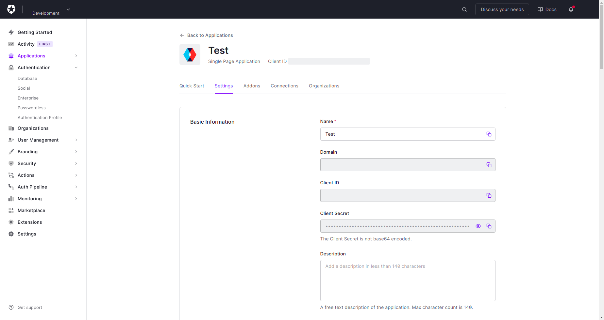
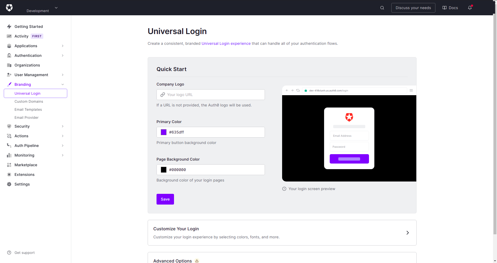

# LABORATORY-AUTH0


## Development

The project is a react application built inside a NX WorkSpace.

There is 2 pages:

- **Home**: With a login and logout button
- **Profile**: Restricted page, showing the information obtained from our OIDC

#### App

Auth0 need a way to know which application is linked to which client on their platform. For this, they created a provider component that will provide the information to the entire application:

```js
import { Auth0Provider } from '@auth0/auth0-react';

<Auth0Provider
    domain="...."
    clientId="....."
    redirectUri={window.location.origin}
/>
```

This component can be found in the root of our app inside `main.tsx`. The information can be found in the Auth0 website. Look the next section for more information.

#### Home

The home page use a hook for showing the right button depending of the authentication status. If the user is connected, we show him the button component for logout or else we show him the login button. 

```js
import { useAuth0 } from '@auth0/auth0-react';

const { isAuthenticated, isLoading } = useAuth0();
```

The hook above is the part of the code that it will give us the state of our user.

The login button will redirect the user to the login page of auth0 using the information inside the provider define at the root of our app.

```js
import { useAuth0 } from '@auth0/auth0-react';

const { loginWithRedirect } = useAuth0();

<button onClick={() => loginWithRedirect()} />
```

While our logout button will call the logout method from our hook:

```js
import { useAuth0 } from '@auth0/auth0-react';

const { logout } = useAuth0();

<button onClick={() => logout()} />
```

#### Profile

This page is restricted to the user connected to auth0. This condition has been set using the following hoc:

```js
export default withAuthenticationRequired(Profile, {
  onRedirecting: () => <Loading />,
});
```

In case, the user enter directly the url, the url will be redirect to the login page of Auth0.

Finally, for getting all the information, we are using the return of the hook.

```js
const { user } = useAuth0();
```


## Auth0 Settings

Most of the settings will happen on the Auth0 platform. After some testing with it, I found it quite agreable to use. The documentation however is way to split for finding whatever you are trying to find. So I wasted some time before I found why my passwordless login was not proposing me to enter a code.


The first important page is in `Application`, the entire information to give to the provider in React can be found there:



In the same page, we also need to define where the login will redirect us, what url is allowed to use this login and so on. Since I am using everything locally, I have configured every part of this section with the local url: *http://localhost:4200*


My goal with this laboratory was to experiment how passwordless appilcation work with a OIDC. So I needed to activate the passwordless requirement.

For this, I clicked on the menu in `Authentification` and `passwordless`. You have there two choices. I could have connected twilio and play with the sms passwordless system but I decided to go with the email system. And also, I dont have any money to spend on twilio.


Upon activation, a popup will open where you can define the email that will be sent. In my case I did not really wanted to make any difference. So I just keep their template as it was.


In the next tab, I activated the passwordless on the application I configured earlier.


The next step is in the branding, we need to activate the Universal Login in order to be able to use our new MFA system. Since I am not really planning to use this for a company but just testing the feature, I just save this part and clicked on the `Advanced Options`



In the `Login` tab, I activated the customize login page and I did the same for the MFA page (Multi-Factor Authentication Page) since I will be using it for entering the code:


Upon this, I was finally able to use my OIDC has a poasswordless system using the email for receiving a code giving me the authentification and information for my app.
#### A bit more

In Auth0, you can obviously, look at who is connecting, when and what did they use. We can change anything related to them.


We can also check and configure multiple database and system of authentification. Every is as simple as a toggle to switch.


## Running

With NX, the following command can run the application:

```bash
$ run serve app-auth0
```

## System

Ubuntu Version: Ubuntu 20.04.1 LTS
Node Version: v16.15.1

```bash
# Get the version of node
$ node -v

# Get the latest version of ubuntu
$ lsb_release -a
```

