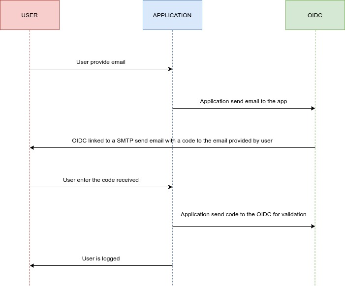

# LABORATORY-AUTH0




## Development

The project is a react application built inside a NX WorkSpace.

There is 2 pages:

- **Home**: With a login and logout button
- **Profile**: Restricted page, showing the information obtained from our OIDC

#### App

Auth0 need a way to know which application is linked to which client on their platform. For this, they created a provider component that will provide the information to the entire application:

```js
import { Auth0Provider } from '@auth0/auth0-react';

<Auth0Provider
    domain="...."
    clientId="....."
    redirectUri={window.location.origin}
/>
```

This component can be found in the root of our app inside `main.tsx`.

#### Home

The home page use a hook for showing the right button depending of the authentication status. If the user is connected, we show him the button component for logout or else we show him the login button. 

```js
import { useAuth0 } from '@auth0/auth0-react';

const { isAuthenticated, isLoading } = useAuth0();
```

The hook above is the part of the code that it will give us the state of our user.

The login button will redirect the user to the login page of auth0 using the information inside the provider define at the root of our app.

```js
import { useAuth0 } from '@auth0/auth0-react';

const { loginWithRedirect } = useAuth0();

<button onClick={() => loginWithRedirect()} />
```

While our logout button will call the logout method from our hook:

```js
import { useAuth0 } from '@auth0/auth0-react';

const { logout } = useAuth0();

<button onClick={() => logout()} />
```

#### Profile

This page is restricted to the user connected to auth0. This condition has been set using the following hoc:

```js
export default withAuthenticationRequired(Profile, {
  onRedirecting: () => <Loading />,
});
```

In case, the user enter directly the url, the url will be redirect to the login page of Auth0.

Finally, for getting all the information, we are using the return of the hook.

```js
const { user } = useAuth0();
```


## Auth0 Settings


## Running

With NX, the following command can run the application:

```bash
$ run serve app-auth0
```

## System

Ubuntu Version: Ubuntu 20.04.1 LTS
Node Version: v16.15.1

```bash
# Get the version of node
$ node -v

# Get the latest version of ubuntu
$ lsb_release -a
```

